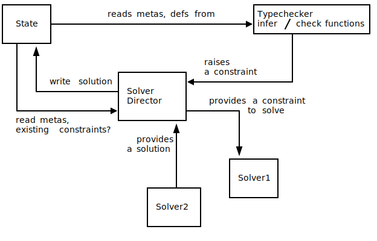

# Introduction #  {#sec:introduction}

Strongly-typed languages allow us to catch certain classes of bugs at compile-time by checking the implementation against the type-signature.
When the types are provided by the user it can be viewed as a form of specification, constraining the behaviour of the programs.
This comes with the benefit of more static guarantees but with an increased toll on the user to supply more precise information about the program.
Since type is part of the specification we can use this information to infer parts of our program, following an idea that Connor McBride aptly worded as "Write more types and fewer programs." [@ptoopTypeInferenceThought2022; @mcbrideEpigramPracticalProgramming2005 chap. 2.1]
Some examples here include overloaded functions in Java, implicits in Scala, and type classes in Haskell.

In dependently-typed languages like Agda [@norellPracticalProgrammingLanguage2007; @theagdateamAgdaUserManual2022], Coq [@thecoqdevelopmentteamCoqProofAssistant2022] or Idris [@bradyIdrisGeneralpurposeDependently2013] the types can be much more precise.
This gives us an opportunity to infer even larger parts of our programs from the type in the process of elaboration.
Techniques here include implicit arguments in Agda, implicit coercions in Coq, and tactic arguments in Idris.
The inference or "solving" can be not only automatic but also interactive or partially automatic.
For example, holes in Agda, proof obligations and canonical structures [@mahboubiCanonicalStructuresWorking2013] in Coq, and holes in Haskell [@koppelSearchingEntangledProgram2022].
All of these mechanisms use different solvers and have various degrees of extensibility.
They are usually not isolated from each other and can therefore interact in the way the user expects them to (for example, in this case between implicits and instances [@agdausersPerformanceRegressionIssue2018]).

In all of these examples, the solvers evolved organically over time together with the language.
Coq historically struggled with similar issues in the elaborator: for example, Canonical Structures wasn't properly documented for 15 years
[@mahboubiCanonicalStructuresWorking2013].
Agda experimented with features baked into the core of the type system, like sized types which brought their own solver infrastructure [@abelExtensionMartinLofType2016].
Lean 4 is aiming to allow the users to develop new surface-level features [@leonardodemouraLeanMetaprogramming2021] using elaboration monads [@mouraLeanTheoremProver2021], somewhat akin to Idris [@christiansenElaboratorReflectionExtending2016], but Lean 3 was built in a more conventional way [@demouraLeanTheoremProver2015a].
These solvers operate on constraints generated by the type-checker, where the constraints say something about as-of-yet unknown parts of the program, which are referred to as metavariables, also known as "existential variables" [@thecoqdevelopmentteamCoqProofAssistant2022, chap. 2.2.1].

While the features above may be specific to the language, a common need is to check two terms for equality, dubbed "conversion checking", which goes hand in hand with unification.
This code is heavily used throughout the compiler, for inference of implicit arguments and for general type-checking, making it sensitive towards changes and hard to maintain and debug.
It is hard enough to understand that breaking changes are often discovered only when ran against a large existing project on CI, like `cubical` or `stdlib` for Agda or `unimath` for Coq.
Unification problems can be seen as a kind of constraints -- a viewpoint that already exists in Agda, Idris, and Lean, and we shall assume it too throughout the paper.

In this paper we propose a new architecture for an extensible elaborator for dependently-typed languages.
The idea is to provide an API for developers to tap into the elaboration procedure with custom solvers that can manipulate metavariables and constraints placed on them.
This design separates the what the solvers are doing from the when, making it explicit what are the interaction points between different parts of the type-checker.
In its own turn, this allows the developer to reason more easily about exceptions and asynchronisity in the type-checker and add new features in a more contained fashion.
Practically, this means that adding a new feature for the most part is contained within one module, as opposed to being spread around the codebase.

Contributions:

* We propose a new design blueprint for a language that is extensible with new constraints and their solvers. It supports type classes, implicit arguments, implicit coercions, context arguments (as implemented in Scala) and tactic arguments.
* We suggest a view on metavariables as communication channels for the solvers, drawing parallels with asynchronous programming primitives.
* We render the usual components of a type-checker, like the unifier in Agda, as a suite of solvers which can be extended and interleaved with user-provided ones.
* We present a prototype implementation of a dependently-typed language with an extendable unifier, implicit arguments, type classes as a practical validation of the design.

# Unification, constraint-based elaboration and design challenges # {#sec:unification_constraint_based_elaboration_and_design_challanges}

Constraints have been an integral part of compilers for strongly-typed languages for a while [@oderskyTypeInferenceConstrained1999].
For example, both Haskell [@vytiniotisOutsideInModularType2011] and Agda [@norellPracticalProgrammingLanguage2007 chap. 3] use constraints extensively.
In the former case, they are even reflected and can be manipulated by the user [@orchardHaskellTypeConstraints2010a; @ghcdevelopmentteamGHCUserGuide2022, chap. 6.10.3].
This has proved to be a good design decision for GHC, as is reflected, for example in a talk by @peytonjonesTypeInferenceConstraint2019, as well as in a few published sources [@vytiniotisOutsideInModularType2011; @peytonjonesPracticalTypeInference2007].

In the land of dependently-typed languages constraints are much less principled.
Agda has a family of constraints[^agda-constraints-datatype] that grew organically, currently counting 17 constructors.
Idris technically has constraints[^idris-constraints-datatype] with the only two constructors being equality constraint for two terms and for two sequences of terms.
The same[^lean-constraints-datatype] holds for Lean.
These languages either use constraints in a very restricted, single use-case manner -- for unification, namely -- or in an unprincipled way.
In our view, more methodical approach to constraints will result in a more robust elaborator as a whole.

In this section we go over three typical challenges that come up while building a compiler for a dependently-typed language and the way they are usually solved.
We cover unification of the base language and the complexity of managing the state of the unifier in section @sec:conversion_checking.
Then we take a look at different kinds of implicit arguments and their implementation in section @sec:implicit-arguments.
We briefly touch on the problem of extending the unifier in section @sec:extending-unification.
Finally, we talk about the ideas behind the new design in section
@sec:what-is-our-design-bringing-into-the-picture.

[^agda-constraints-datatype]:
We shorten the links in footnotes to paths in the repository, the source code can be found at [github.com/agda/agda/blob/v2.6.2.2/](https://github.com/agda/agda/blob/v2.6.2.2/).
[./src/full/Agda/TypeChecking/Monad/Base.hs#L1064-L1092](https://github.com/agda/agda/blob/v2.6.2.2/src/full/Agda/TypeChecking/Monad/Base.hs#L1064-L1092)

[^idris-constraints-datatype]: [./src/Core/UnifyState.idr](https://github.com/idris-lang/Idris2/blob/e673d05a67b82591131e35ccd50fc234fb9aed85/src/Core/UnifyState.idr) at [github.com/idris-lang/Idris2/blob/e673d0](https://github.com/idris-lang/Idris2/blob/e673d05a67b82591131e35ccd50fc234fb9aed85)

[^lean-constraints-datatype]: [./src/Lean/Meta/Match/Basic.lean#L161](https://github.com/leanprover/lean4/blob/0a031fc9bbb43c274bb400f121b13711e803f56c/src/Lean/Meta/Match/Basic.lean#L161) at [github.com/leanprover/lean4/blob/0a031f](https://github.com/leanprover/lean4/blob/0a031fc9bbb43c274bb400f121b13711e803f56c/)

## Conversion checking in the presence of a meta-variables ## {#sec:conversion_checking}

As mentioned in the introduction, in the process of type-checking a program we need to compare terms and it is the job of the unifier, which is notoriously hard to implement.
The complexity stems from the desire of compiler writers to implement the most powerful unifier, while being limited by the fact that it higher-order unification is undecidable in general.
Some of this complexity is unavoidable, but we can manage it better by splitting it up into small modular components.
In practice, this means that one doesn't have to fit together an always-growing conversion checker but can instead write different cases separately.
We rely on the constraint solver machinery to distribute the problems to the fitting solvers.

An example from Agda's conversion checker is `compareAs` function[^compareAs-fucntion] which provides type-driven conversion checking.
The function is almost 90 lines long, and yet the vast majority of it is special cases of metavariables.
This function calls the `compareTerm'` function[^compareTerm-function], which itself is 130 lines.
`compareTerm'` calls the `compareAtom` function[^compareAtom-function]:.
Which itself is almost 200 lines of code.
Each of the above functions implements part of the "business logic" of the conversion checker.
But each of them contains a lot of code dealing with bookkeeping related to metavariables and constraints:

1. They have to throw and catch exceptions, driving the control flow of the unification.
2. They have to compute blocking tags that determine when a postponed constraint is retried.
3. They have to deal with cases where either or both of the sides equation or its type are either metavariables or terms whose evaluation is blocked on some metavariables.

This code is also heavily used throughout the type-checker: either as direct functions `leqType` when type-checking terms, `compareType` when type-checking applications, or as raised constraints `ValueCmp` and `SortCmp` from `equalTerm` while checking applications or definitions, `ValueCmpOnFace` from `equalTermOnFace` again while checking applications.
And at the same it is unintuitive and full of intricacies as indicated by multiple comments[^intricate-comments].

We would like the compiler-writer to separate the concerns of managing constraints, blockers from the actual logic of the comparison function.
In fact, if we zoom in on the `compareAtom` function, the core can be expressed in about 20 lines[^20lines-compareAtom] of simplified code, stripping out size checks, cumulativity, polarity, and forcing.
Which is precisely what we'd like the developer to write.

``` haskell
case (m, n) of
  (Lit l1, Lit l2) | l1 == l2 -> return ()
  (Var i es, Var i' es') | i == i' -> do
      a <- typeOfBV i
      compareElims [] [] a (var i) es es'
  (Con x ci xArgs, Con y _ yArgs) | x == y -> do
      t' <- conType x t
      compareElims t' (Con x ci []) xArgs yArgs
  ...
```


The functions described above are specific to Agda but in other major languages we can find similar problems with unifiers being large modules that are hard to understand.
The sizes of modules with unifiers are as follows: Idris ([1.5kloc](https://github.com/idris-lang/Idris2/blob/102d7ebc18a9e881021ed4b05186cccda5274cbe/src/Core/Unify.idr)), Lean ([1.8kloc](https://github.com/leanprover/lean4/blob/75252d2b85df8cb9231020a556a70f6d736e7ee5/src/Lean/Meta/ExprDefEq.lean)), Coq ([1.8kloc](https://github.com/coq/coq/blob/b35c06c3ab3ed4911311b4a9428a749658d3eff1/pretyping/evarconv.mli)).
For Haskell, which is not a dependently-typed language yet but does have a constraints system [@peytonjonesTypeInferenceConstraint2019], this number is at [2kloc](https://gitlab.haskell.org/ghc/ghc/-/blob/b81cd709df8054b8b98ac05d3b9affcee9a8b840/compiler/GHC/Core/Unify.hs).

[^compareAs-fucntion]: [./src/full/Agda/TypeChecking/Conversion.hs#L146-L218](https://github.com/agda/agda/blob/v2.6.2.2/src/full/Agda/TypeChecking/Conversion.hs#L146-L218)
[^compareTerm-function]: [./src/full/Agda/TypeChecking/Conversion.hs#L255-L386](https://github.com/agda/agda/blob/v2.6.2.2/src/full/Agda/TypeChecking/Conversion.hs#L255-L386)
[^compareAtom-function]: [./src/full/Agda/TypeChecking/Conversion.hs#L419-L675](https://github.com/agda/agda/blob/v2.6.2.2/src/full/Agda/TypeChecking/Conversion.hs#L419-L675)
[^intricate-comments]: [./src/full/Agda/TypeChecking/Conversion.hs#L430-L431](https://github.com/agda/agda/blob/v2.6.2.2/src/full/Agda/TypeChecking/Conversion.hs#L430-L431), [./src/full/Agda/TypeChecking/Conversion.hs#L521-L529](https://github.com/agda/agda/blob/v2.6.2.2/src/full/Agda/TypeChecking/Conversion.hs#L521-L529)
[^20lines-compareAtom]:
[./src/full/Agda/TypeChecking/Conversion.hs#L530-L579](https://github.com/agda/agda/blob/v2.6.2.2/src/full/Agda/TypeChecking/Conversion.hs#L530-L579)

## Type-checking function application in the presence of implicit arguments ## {#sec:implicit-arguments}

During the type-checking of function application there may be different kinds of arguments to process, for example, instance arguments, implicit arguments, or tactic arguments.
If we start from a simple case of type-checking an application of a function symbol to regular arguments, every next extension requires to be handled in a special case.

Take Agda -- when checking an application during the insertion of implicit arguments [^agda-insertion-of-implicit-arguments] we already have to carry the information on how the argument will be resolved and then create a specific kind of metavariables [^agda-specific-kinds-of-metavariables] [@norellPracticalProgrammingLanguage2007 chap. 3] - for each of those cases.

Idris 2 [@theidristeamIdrisTutorial2021, chap. 13.1] in the case of `auto` variables  has to essentially do inline the search procedure through a chain of elaboration function calls (`checkApp` to `checkAppWith` to `checkAppWith'`) to `makeAutoImplicit`[^idris2-makeautoimplicit-source].
This can accommodate interfaces (or type classes), but one can imagine that if a different kind of implicit was added, like tactic arguments, or Canonical Structures we'd have to inline the search again, requiring a non-trivial modification to the elaboration mechanism.

[^idris2-makeautoimplicit-source]:
[./src/TTImp/Elab/App.idr#L224-L241](https://github.com/idris-lang/Idris2/blob/870bc824371d504a03af937f326216302210a875/src/TTImp/Elab/App.idr#L224-L241)

[^agda-insertion-of-implicit-arguments]: [./src/full/Agda/TypeChecking/Implicit.hs#L99-L127](https://github.com/agda/agda/blob/v2.6.2.2/src/full/Agda/TypeChecking/Implicit.hs#L99-L127)

[^agda-specific-kinds-of-metavariables]: [./src/full/Agda/TypeChecking/Implicit.hs#L131-L150](https://github.com/agda/agda/blob/v2.6.2.2/src/full/Agda/TypeChecking/Implicit.hs#L131-L150)

While the codebases above show that it is certainly possible to extend languages with new features if the language wasn't written with extensibility in mind this can lead to rather ad-hoc solutions.
Instead is of handling every kind of metavariable in a separate way we'd like to uniformly dispatch a search for the solution, which is then handled by the constraint solvers.
We can achieve this by creating metavariables for the unknown terms and then raising a constraint for the meta containing the type of the meta.
Then this constraint can be matched on by the appropriate solver based on the type and the elaborator for the application of a function doesn't have to know anything about the implicits at all.
The only thing we require is that the elaboration of the argument is called with the type information available.
This corresponds to how in bidirectional typing function application is done in the inference mode but the arguments are processed in checking mode.

``` haskell
inferType (App t1 t2) = do
  (et1, Pi tyA tyB) <- inferType t1
  et2 <- checkType t2 tyA
  return (App et1 et2, subst tyB et2)
```

```haskell
checkType (Implicit) ty = do
  m <- createMetaTerm
  raiseConstraint $ FillInTheMeta m ty
  return m
```

This metavariable in its own turn gets instantiated by a fitting solver.
The solvers match the shape of the type that metavariable stands for and handle it in a case-specific manner: instance-search for type classes, tactic execution for a tactic argument.

If it is a regular implicit, however, the only solver that's needed is a trivial one that checks that the metavariable has been instantiated indeed.
This is because a regular implicit should be instantiated by a unification problem encountered at some point later.
This serves as a guarantee that all implicits have been filled in.

Let us go through an example of the elaboration process for a simple term: \todo{remove?}

```
plus  :  {A : Type} -> {{PlusOperation A}}
     -> (a : A) -> (b : A) -> A

instance PlusNat : PlusOperation Nat where
  plus = plusNat

two = plus 1 1
```

We will step through the elaboration of the term `two`.

1. First, the pre-processor eliminates the implicits and type-class arguments.
   We end with the following declarations:
   ```
   plus : (impA : Implicit Type)
       -> TypeClass PlusOperation (deImp impA)
       -> (a : deImp impA) -> (b :  deImp impA)
       ->  deImp impA
   
   PlusNat = Instance {
       class = PlusOperation Nat,
       body = {plus = plusNat}}
   
   two = plus _ _ 1 1
   ```
2. We go into the elaboration of `two` now.
   The elaborator applies `inferType (App t1 t2)` rule four times and `checkType (Implicit) ty` twice on the two placeholders.
   The output of the elaborator is
   ```
   two = plus ?_1 ?_2 1 1
   ```
   And the state of the elaborator contains four more constraints:
   ```
   C1: FillInTheTerm ?_1 (Implicit Type)
   C2: FillInTheTerm ?_2 (TypeClass
                          PlusOperation (deImp ?_1))
   C3: EqualityConstraint ?_1 Nat Type
   C4: EqualityConstraint ?_1 Nat Type
   ```
   
   The first two correspond to implicit arguments.
   The latter two are unification problems rendered into constraints.

3. Now we step into the constraint-solving world.
   First, the unifier solves the latter two, instantiating `?_1` to `Nat`.
   Next, the typeclass resolution launches a search for the instance, resolving `?_2` to the `PlusNat` instance.
   Finally, C1 is discarded as solved since `?_1` is already instantiated to `Nat`.

## Extending unification ## {#sec:extending-unification}

While writing a unifier is hard enough as it is, at times the developers might want to give their users ability to extend the unification procedure.

Canonical Structures [@saibiOutilsGeneriquesModelisation1999; @mahboubiCanonicalStructuresWorking2013] was already mentioned as it is in the overlap between type classes and unification hints.
Adding it to a language that doesn't support them requires an extension of unification algorithm with a rule that says that projection from a canonical structure is an injective function [@mahboubiCanonicalStructuresWorking2013, equation 1].

One could also provide means to do so manually in a more general case, by allowing users to declare certain symbols as injective.
This is one of the features requested by the Agda users [@agdausersInjectiveUnificationPragma2023].

Another example of this can be adding rules of associativity and commutativity to the unifier, as described in the thesis by @holtenDependentTypeCheckingModulo2023.
It required 2000 lines of code added while relying on rewrite rules [^holten-source]
We would like to make changes such as this more feasible.

[^holten-source]: [github.com/LHolten/agda-commassoc/tree/defenitional-commutativity](https://github.com/LHolten/agda-commassoc/tree/defenitional-commutativity)

## What is our design bringing into the picture? ## {#sec:what-is-our-design-bringing-into-the-picture}

The examples above show that when building a dependently-typed language while the core might be perfectly elegant and simple, the features that appear on top of it complicate the design.

One can also observe that while the code above might rely on constraints, the design at large doesn't put at the centre of the picture and instead is primarily seen as a gadget.
To give a concrete example, Agda's constraint solver[^agda-constraint-solver-source] relies on the type-checker to call it at the point where it is needed and has to be carefully engineered to work with the rest of the codebase.
To give a concrete example, functions `noConstraints` or `dontAssignMetas` rely on specific behaviour of the constraint solver system and are used throughout the type-checker.
`abortIfBlocked`, `reduce` and `catchConstraint`/`patternViolation` force the programmer to make a choice between letting the constraint system handle blockers or doing it manually.
These things are known to be brittle and pose an increased mental overhead when making changes.

Our idea for a new design is to shift focus more towards the constraints themselves:

1. We give a stable API for raising constraints that can be called by the type-checker, essentially creating an "ask" to be fulfilled by the solvers.
This is not dissimilar to the idea of mapping object-language unification variables to host-language ones as done by @guidiImplementingTypeTheory2017, view of the "asks" as a general effect [@bauerEqualityCheckingGeneral2020, ch. 4.4] or communication between actors [@allaisTypOSOperatingSystem2022a].

2. Make the language more modular we make constraints an extensible data type in the style of @swierstraDataTypesCarte2008 and give an API to define new solvers with the ability to specify what kinds of constraints they can solve.

In the examples in this paper, we follow the bidirectional style of type-checking, but in practice, the design decisions are agnostic of the underlying system, as long as it adheres to the principle of stating the requirements on terms in terms of raising a constraint and not by, say, pattern-matching on a concrete term representation.

From a birds-eye view the architecture looks as depicted in [Figure 1](#architecture-figure) \todo{redo and update}

{#architecture-figure width=50%}

In the diagram type-checker is precisely the part that implements syntax-driven traversal of the term.
It can raise a constraint that gets registered by the Solver Director.
Solver Director then is exactly the component that dispatches solvers on the appropriate constraints and constitutes our main contribution.
All of the components have some read access to the state, including Solver which might e.g. verify that there are no additional constraints on the meta.

[^agda-constraint-solver-source]:
[src/full/Agda/TypeChecking/Constraints.hs#L251-L301](https://github.com/agda/agda/blob/v2.6.2.2/src/full/Agda/TypeChecking/Constraints.hs#L251-L301)

# Dependently-typed calculus and bidirectional typing # {#sec:bidirectional}

In this section, we describe the core of the type system we implement.
We take pi-forall [@weirichImplementingDependentTypes2022] as a basis for the system and add metavariables to it.
However, for all other purposes, we leave the core rules intact and therefore, the core calculus too.

## Basic language and rules ##

This is dependently-typed calculus that includes Pi, Sigma and indexed inductive types.

Here's an almost complete surface-language term data type:

```haskell
data Term =
  -- type of types Type
    Type
  -- variables x
  | Var TName
  -- abstraction \x. a
  | Lam (Bind TName Term)
  -- application a b
  | App Term Arg
  -- function type (x : A) -> B
  | Pi Epsilon Type (Bind TName Type)
  -- Sigma-type { x : A | B }
  | Sigma Term (Bind TName Term)
  | Prod Term Term
  | LetPair Term (Bind (TName, TName) Term)
  -- Equality type  a = b
  | TyEq Term Term
  | Refl
  | Subst Term Term
  | Contra Term
  -- inductive datatypes
  | TCon TCName [Arg] -- types (fully applied)
  | DCon DCName [Arg] -- terms (fully applied)
  | Case Term [Match]
    -- metavariables
  | MetaVar MetaClosure
```

Equality isn't defined as a regular inductive type, but is instead built-in with the user getting access to the type and term constructor, but not able to pattern-matching on it, instead getting a `subst` primitive of type `(A x) -> (x=y) -> A y` and `contra` of type `forall A. True = False -> A`.

On top of the above we include indexed inductive datatypes and case-constructs for their elimination.
Indexed inductive datatypes are encoded using a well-known trick \todo{citation} as parameterised inductive datatypes with an equality argument constraining the index.

## Syntax traversal ##

We implement the core of the elaborator as a bidirectional syntax traversal, raising a constraint every time we need to assert something about the type.

This includes the expected use of unification constraints, like in case we enter check-mode while the term should be inferred:

```haskell
checkType tm ty = do
  (etm, ty') <- inferType tm
  constrainEquality ty' ty I.Type
  return $ etm
```

Any time we want to decompose the type provided in checking mode:

```haskell
checkType (S.Lam lam) ty = do
  mtyA <- createMetaTerm
  mtx <- createUnknownVar
  mtyB <- extendCtx (I.TypeSig (I.Sig mtx mtyA))
                    (createMetaTerm)
  let mbnd = bind mtx mtyB
  let metaPi = I.Pi mtyA mbnd

  constrainEquality ty metaPi I.Type
  -- rest of the traversal can now use mtyA and mbnd
  ...
```

At certain points we have to raise a constraint which has an associated continuation.
Like for checking the type of a data constructor -- the part of the program that comes as an argument to `CA.constrainTConAndFreeze` will be suspended (or "blocked") until the constraint has been resolved.

```haskell
checkType t@(S.DCon c args) ty = do
  elabpromise <- createMetaTerm
  CA.constrainTConAndFreeze ty $ do
    mty <- SA.substMetas ty
    case mty of
      (I.TCon tname params) -> do
t        ...
      _ -> ...
```

# Constraints and unification # {#sec:constraints_and_unification}

The datatype of constraints is open which means the user can write a plugin to extend it.
However, we provide a few out of the box to be able to type-check the base language.

For the purposes of the base language it suffices to have the following.

* Two terms of certain type must be equal, encodes unification problems
  ``` haskell
  -- two terms given should be equal
  data EqualityConstraint e =
       EqualityConstraint Syntax.Term Syntax.Term
                          Syntax.Type Sytax.MetaVarId
  ```
* Ensures that a metavariable is resolved eventually:
  ```haskell
  -- this terms has to be filled in
  data FillInTheTerm e =
       FillInTheTerm Syntax.Term (Maybe Syntax.Type)
  ```
* Lastly, we provide a constraint which ensures that a term is a type constructor.
  This could've been encoded as a unification problem, but since we don't have to limit ourselves in the constructors of the constaint datatype and there are no real downsides to factoring a problem out we include it separately:
  ```haskell
  -- the term passed to the constraint
  -- should be a type constructor
  data TypeConstructorConstraint e =
       TypeConstructorConstraint Syntax.Type
  ```

The type-checker raises them supplying the information necessary, but agnostic of how they'll be solved.

## Introduction to the solvers ##

On the solver side we provide a suite of unification solvers that handle different cases of the problem:


``` haskell
-- solves syntactically equal terms
syntacticSolverHandler :: (EqualityConstraint :<: c)
                       => Constraint c -> MonadElab Bool
syntacticSolver :: (EqualityConstraint :<: c)
                => Constraint c -> MonadElab Bool
syntactic :: Plugin
syntactic  = Plugin { solver  = syntacticSolver
                    , handler = syntacticSolverHandler
                    ...
                    }
```

We first define the class of constraints that will be handled by the solver via providing a "handler" -- function that decides whether a given solver has to fire.
In this case, this amounts to checking that the constraint given is indeed an `EqualityConstraint` and that the two terms given to it are syntactically equal.
Then we define the solver itself.
Which in this case doesn't have to do anything except mark the constraint as solved, since we assume it only fires once it's been cleared to do so by the handler.
The reason for this separation between a decision procedure and execution of it is to ensure separation between effectful and costly solving and cheap decision-making that should require only read-access to the state.
Finally, we register the solver by declaring it using a plugin interface.
This plugin symbol will be picked up by the linker and registered at the runtime.

Similarly, we can define solvers that only work on problems where only one of the sides is a metavariable, `leftMetaSolver` and `rightMetaSolver` of the same type as the syntactic solver above and corresponding handlers and plugins.

Here the job of the solver is not as trivial -- it has to check that the type of the other side indeed matches the needed one and then register the instantiation of the metavariable in the state.
If both of those steps are successful we can return `True` and the constraint will be marked as solved.

In the cases above we don't have to worry about the order since the problems they match on don't overlap.
In the case they don't we can provide priority preferences:

``` haskell
complexSolver1 :: Constraint c -> MonadElab Bool
complexHandler1 :: Constraint c -> MonadElab Bool
complexSymbol1 = "complexSolver1"
complex1 = Plugin { ...
                  , symbol   = complexSymbol1
                  , pre = [ unifySolverLS
                          , unifySolverRS]
                  , suc = []
                  }

complexSolver2 :: Constraint c -> MonadElab Bool
complexHandler2 :: Constraint c -> MonadElab Bool
complexSymbol2 = "complexSolver2"
complex2 = Plugin { ...
                  , symbol   = complexSymbol2
                  , pre = [complexSymbol1]
                  , suc = []
                  }
```

At the time of running the compiler, these preferences are loaded into a big pre-order relation for all the plugins, which is then linearised and used to guide the solving procedure.

## Unification ##

We implement a system that is very close to the system implemented by @abelHigherOrderDynamicPattern2011 with the exception that every function call in the simplification procedure is now a raised constraint.

For example, the "decomposition of functions" [@abelHigherOrderDynamicPattern2011, fig. 2] rule is translated to the following implementation:

```haskell
piEqInjectivitySolver :: (EqualityConstraint :<: cs)
                      => SolverType cs
piEqInjectivitySolver constr = do
  let (Just (EqualityConstraint (I.Pi a1 b1)
                                (I.Pi a2 b2) _ m)) =
      match @EqualityConstraint constr
  ma <- constrainEquality a1 a2 I.Type
  (x, tyB1, _, tyB2) <- unbind2Plus b1 b2
  let mat = I.identityClosure ma
  mb <- extendCtx (I.TypeSig (I.Sig x e1 mat)) $
                  constrainEquality tyB1 tyB2 I.Type
  let mbt = bind x $ I.identityClosure mb
  solveMeta m (I.Pi mat mbt)
  return True
```

The seemingly spurious metavariable `m` serves as an anti-unification [@pfenningUnificationAntiunificationCalculus1991] communication channel.
When an equality constraint is created we return a metavariable that stands for the unified term.
This metavariable is used for unification problems that are created in the extended contexts -- in this case second argument of the Pi-type, but also when solving equalities concerning two data constructors.
We do this to solve the "spine problem" [@victorlopezjuanPracticalHeterogeneousUnification2021, sec. 1.4] -- we operate according to the "well-typed modulo constraints" principle essentially providing a placeholder that is guaranteed to preserve well-typedness in the extended context.
In case one of the constraints created in the extended context when solving it we might need to know the exact shape of `ma`.
In which case we can can block on the metavariable, freezing the rest of the problem until it is instantiated.

As for the actual unification steps, we implement them in a similar fashion to simplification procedure.
Take a look at the following example, when only the left hand side of the constaint is an unsolved meta:

```haskell
leftMetaSolver :: (EqualityConstraint :<: cs)
               => SolverType cs
leftMetaSolver constr = do
  let (Just (EqualityConstraint t1 t2 _ m)) = match @EqualityConstraint constr
      (MetaVar (MetaVarClosure m1 c1)) = t1
  mt2 <- occursCheck m1 t2
  case mt2 of
    Left e -> do -- indicates a failure in occurs-check
      return False
    Right t2 -> -- indicates a passed occurs-check
      case (invertClosureOn c1 (freeVarList t2)) of
        Just s -> do
          let st2 = Unbound.substs s t2
          solveMeta m1 st2
          solveMeta m st2
          return True
        Nothing -> return False
```

Once the occurs-check returns and depending whether the result was successful we apply the inverted closure to the right-hand side of the equality.

By splitting up the rules into individual, simple solvers we can compartmentalise the complexity of the unifier, making sure that each rule is as decoupled from the others as possible.
This doesn't influence the properties of the system, but doesn't help to guarantee them either.
If one wishes to prove correctness of the unification the same work has to be done as in the usual setting.

## Extending unification ##

Let's create a simple plugin that makes certain symbols declared by the user injective.

The actual implementation is relatively simple and isn't dissimilar to the Pi-injectivity solver we showed above.

```haskell
userInjectivitySolver :: (EqualityConstraint :<: cs)
                      => SolverType cs
userInjectivitySolver constr = do
  let (Just EqualityConstraint (I.App (I.Var f) a)
                               (I.App (I.Var g) b) _ m)) =
      match @EqualityConstraint constr
  if f == g
  then do
    ifM (queryInjectiveDeclarations f)
        (do
           solveMeta m =<< constrainEquality a b I.Type
           return True)
        (return False)
  else return False
```

where `queryInjectiveDeclarations` simply scans the available declarations for a marker that `f` has been declared injective.

The only big thing left is to make sure that this solver fires at the right time.
This can only conflict with the "decomposition of neutrals" rule, so we indicate to the Solver Direction that our plugin should run before the it:

```haskell
userInjectivityPlugin :: (EqualityConstraint :<: cs)
                      => Plugin cs
userInjectivityPlugin =
  Plugin { ...
         , solver = userInjectivitySolver
         , symbol = "userInjectivity"
         , pre = [ unifyNeutralsDecomposition
                 , unificationStartMarkerSymbol]
         , suc = [unificationStartMarkerSymbol]
         }
```

This modification doesn't alter the core of the language.
However, implementing something like commutativity and associativity unifiers can require modifications in the core, since we two terms that are equal during elaboration have to equal during core type-checking too.

# Open datatype of constraints and case studies # {#sec:casestudies}

Let's now take a look at what the openness of the constraint datatype buys us in this design.
In this section we'll first briefly describe how implicit arguments are implemented and then showcase how to build an extension implementing type-classes into the language.

## Implicit arguments ##

**Plan**:

* show what we need the pre-processor to produce
  * one option here is what's described in section 1, to translate
    ```
    def f : {a : A} -> B a -> C
    
    def f : (A : Implicit Type)
         -> (a : Implicit (deImp A))
         -> (b : B (deIpm a)) -> C
    ```
  * the other option is to make `Implcit A` compute to `A` and make solvers not eager to reduce.
    In that case `deImp` is unnecessary.
* implement tactic arguments with a custom solver for each tactic, like one that just exhaustively searches constructors

## Type classes ##

**Plan**:

* show what we have to desugar instance and type-class declarations to similar to section 1, but more general
* show the implementation of the solvers
* showcase two alternative definitions of the type-class resolution?
* can we extend this to canonical structures here?

# Limitations # {#sec:limitations}

While our design offers a lot of flexibility, some of the things are challenging to implement.
In this section we describe a few examples of extensions that don't quite fit in this framework.

## Handling of meta-variables outside of definition sites ##

After we elaborate a definition there can still be unsolved metas in it.
This presents us with a design choice.
The first option is to freeze the metas and instantiate them per-use site, essentially allowing for an expression to have multiple types.
The second option is to leave them up to be solved later, which might make elaboration less predictable since now the use sites can influence whether a particular definition type-checks.
The third option is to report them as an error and exit immediately.

In particular, the second option allows us to incorporate more involved inference algorithms into the system.
For example, if we were to implement an erasure inference algorithm as described by @tejiscakDependentlyTypedCalculus2020, we would have to create metavariable annotations (described as "evars" in the paper) that can be instantiated beyond the definition site.


## The language is only as extensible, as the syntax traversal is ##

Extensibility via constraints allows for a flexible user-specified control flow as soon as we step into the constraints world.
But control flow of the main body of the basic language elaborator is fixed by the basic language developer.
For example, consider the following simplified lambda-function typechecking function[^agda-lambda-tc-source] from Agda:

``` haskell
checkLambda' cmp b xps typ body target = do
  TelV tel btyp <- telViewUpTo numbinds target
  if size tel < numbinds || numbinds /= 1
    then dontUseTargetType
    else useTargetType tel btyp
```

Here Agda steps away from the bidirectional discipline and infers a (lambda) function if the target type isn't fully known.
If in our design the developer chooses to go only with a pure bi-directional style of type-checking inferred lambda functions would be impossible to emulate.
That is unless one essentially renders macros and writes their own typechecking case for an inferrable lambda.

In order to gain this extra bit of flexibility we provide `inferType` case for lambdas, even though our base language doesn't use it. \todo{actually write this case}

[^agda-lambda-tc-source]: [./src/full/Agda/TypeChecking/Rules/Term.hs#L460-L578](https://github.com/agda/agda/blob/v2.6.2.2/src/full/Agda/TypeChecking/Rules/Term.hs#L460-L578)

## Eager reduction and reliance on the pre-processor ##

This work crucially relies on a pre-processor of some kind, be it macro expansion or some other way to extend the parser with custom desugaring rules.
In particular, in order to implement n-ary implicit arguments correctly and easily we need the pre-processor to expand them to the right arity.
For coercions, we need to substitute every term `t` in the coercible position for `coerce _ t`.
This can impact performance.

Alternatively, one can imagine a system where constraint solvers are latching onto non-reduced types and terms in constraints.
In that case, we can get around with a trick borrowed from Coq, where `coerce f t` computes to `f t`, but since we typechecked an unreduced application the search will still be launched on the right form.

This also means that constraints can/have to match on unreduced types in the e.g. `FillInTheTherm`

# Related work # {#sec:related_work}

We are certainly not the first ones to try to tackle the extensibility of a language implementation.
This section is structured according to the part of the compiler pipeline that allows for extensibility.
Dependently-typed language implementations usually consist of at least four parts:
parser, elaborator, core type-checker, and proper backend.
The back-end part is currently irrelevant to our interests, since for a language to be specified usually means for specification of the core, anything that happens beyond after core doesn't extend the language, but rather tries to preserve its semantics in some form.
Therefore we're left with three parts: parser, elaborator and core type-checker.

We see parser or syntax extensibility as a necessary part of an extensible language.
This problem has been studied extensively in the past and has a multitude of existing solutions.
Macros are one of them and are utilised heavily in various forms in almost all established languages [@thecoqdevelopmentteamCoqProofAssistant2022; @theagdateamAgdaUserManual2022; @ullrichNotationsHygienicMacro2020] and can be powerful enough to build a whole language around [@changDependentTypeSystems2019].

Core extensibility, on the other hand, appears to be a problem with too many degrees of freedom.
Andromeda [@bauerDesignImplementationAndromeda2018; @bauerEqualityCheckingGeneral2020] made an attempt at extensible definitional equality but is quite far from a usable dependently-typed language.
Agda's philosophy allows developers to experiment with the core but also results in a larger amount of unexpected behaviours.
In general, modification of core rules will result in fundamental changes in the type theory, which can break plenty of important properties like soundness or subject reduction.

This leaves us with the question of what can be achieved with the extensibility of an elaborator and why one would need it.
This includes type inference, implicit arguments inference, type classes, tactics, and SMT integration.
Elaborators are often structured similarly to the core type-checker, i.e. following a bidirectional discipline of some sort. One can see that in Agda [@norellPracticalProgrammingLanguage2007], Matita [@tassiBiDirectionalRefinementAlgorithm2012], or in a paper by @ferreiraBidirectionalElaborationDependently2014.

Coq [@thecoqdevelopmentteamCoqProofAssistant2022] being one of the most popular proof assistants invested a lot effort into user-facing features: work on tactics like a new tactic engine [@spiwackVerifiedComputingHomological2011] and tactic languages (Ltac2 [@pedrotLtac2TacticalWarfare2019], SSReflect [@gonthierSmallScaleReflection2008], etc.), the introduction of a virtual machine for performance [@gregoireCompiledImplementationStrong2002] and others.
However, the implementation is quite hard to extend.
One either has to modify the source code, which is mostly limited to the core development team, as seen from the [graph](https://github.com/coq/coq/graphs/contributors).
Or one has to use Coq plugins system, which is rather challenging, and in the end the complexity of it gave rise to TemplateCoq [@malechaExtensibleProofEngineering2014].

Agda introduced a lot of experimental features, but isn't very modular [@robertestelleHeavyCouplingHaskell2019], which hinders further change.

Lean introduced elaborator extensions [@leonardodemouraLeanMetaprogramming2021; @ullrichNotationsHygienicMacro2020].
They allow the user to overload the commands, but if one defines a particular elaborator it becomes hard to interleave with others.
In a way, this is an imperative view on extensibility.

Idris [@bradyIdrisGeneralpurposeDependently2013; @christiansenElaboratorReflectionExtending2016] appeared as a programming language first and proof-assistant second and doesn't provide either a plugin or hook system at all, except for reflection \todo{citation}.
Idris also focuses on tactics as the main mechanism for elaboration.
Metavariables and constraints-wise in contrast with only one kind of meta and constraints in Idris [@bradyIdrisGeneralpurposeDependently2013 chap. 4.2, chap. 4.3.1].

As for the unification, $\text{Tog}^{+}$ [@victorlopezjuanTog2020; @victorlopezjuanPracticalHeterogeneousUnification2021] focuses on extending it to the case where two sides of equality might not be of the same type.
The main argument against the usage of anti-unification in Agda provided there is that it is bug-prone.
On closer inspection, we think that that in Agda, which served as an example of the system where said bugs occur, the problems were stemming from the fact that anti-unification had to be implemented separately from unification, therefore duplicating the code-base.
In which case it is indeed hard to keep the two in sync.
However, in our case there is no such duplication since unification and anti-unification always move synchronously.
Regarding twin types as implemented in $\text{Tog}^{+}$ -- we don't see a reason why it couldn't be done in this setting too, but since it required a rewrite of the system we decided against it in the interest of time.

# Future work #

There are some things we leave for future work.

* Implement erasure inference [@tejiscakDependentlyTypedCalculus2020]?
* Implement Canonical Structures [@mahboubiCanonicalStructuresWorking2013]?
* Rendering of macros as constraints?
  Map a macro to an implicit term with the right kind of annotation in the type, to get the right expander as an elaboration procedure?
* Mapping constraint solving onto a concurrent execution model.
  Use LVars here [@kuperLatticebasedDataStructures2015] here, similar to what TypOS [@allaisTypOSOperatingSystem2022a] is doing?

# References #

::: {#refs}
:::

<!---
Local Variables:
eval: (progn (olivetti-mode 't) (flyspell-mode 't) (flyspell-buffer)) ;; because it looks better this way!
reftex-default-bibliography: ("/home/bohdan/delft/extended-elab/extended-elab/paper/bib.bib") ;; add reftex support
End:
-->
