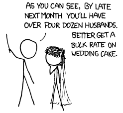

\centering \faceA \faceB

---

\faceA I want to implement a _dependently-typed_ language!

\pause \raggedleft
But do you know what it'll look like? \faceB

\pause \raggedright
\faceA Not yet, but I'll make it modular so I can build it step by step!

\pause \raggedleft
But we want the core to be stable! Figuring it out is hard enough \faceB

\pause \raggedright
\faceA Then we'll fix the core language but make the elaborator modular!

## Elaborator under attack


# How do we design the elaborator?

## How do we design the elaborator?

Elaborators typically consists of  
\hspace{1em} - a syntax traversal  
\hspace{1em} - unifier  
\hspace{1em} - constraints machinery

\

\pause

* Which parts can we make more modular?

* Can we mediate the interactions?

## Constraints in Haskell

```
W = empty
  | W1, W2 # conjunction
  | C t1 .. tn # type class constraint
  | t1 ~ t2 # equality constraint
  | ∀a1..an. W1 => W2 # implication constraint
```

## Constraints in Agda

```
W = ValueCmp t1 t2 # eq comparison
  | ElimCmp typ t1 e1 e2 # elim comparison
  | SortCmp s1 s2 # (type) sort comparisons
  | LevelCmp l1 l2 # (type) level comparisons
  | UnBlock m1 # Meta created for a term blocked
  | FindInstance m1 c # type class instances
  | CheckFunDef ... # couldn't check a function def because
  | UnquoteTactic ...
  ... # plenty more
```

## Constraints in Agda

{height=80%}

## Constraints in Agda {.noframenumbering}

{height=80%}\ {height=50%}\ [^xkcd-source]

[^xkcd-source]: [xkcd.com/605/](https://xkcd.com/605/)

# Our solution

## Our design

- Typechecker traverses the syntax and generates constraints

- The constraint datatype open (as in Data types à la carte [@swierstraDataTypesCarte2008])

- Solvers are provided by the plug-ins

Mantra: constraints are async function calls, metavariables are "promises".

## Our constraints

* aiming for something in-between in the core \faceB + your \faceA extensions
  ```
  CoreW = EqualityComparison t1 t2 ty m
        | BlockedOnMeta m tc
        | FillInMeta m ty
        ...
  ```
* both we \faceB and you \faceA supply the solvers

# Example: type classes

## Type classes: what's in the base \faceB

``` haskell
inferType (App t1 t2) = do
  (et1, Pi tyA tyB) <- inferType t1
  et2 <- checkType t2 tyA
  return (App et1 et2, subst tyB et2)
```

```haskell
checkType (Implicit) ty = do
  m <- createMetaTerm
  raiseConstraint $ FillInTheMeta m ty
  return m
```


## Type classes: what does the user write

```
plus : {A : Type} -> {{PlusOperation A}}
    -> (a : A) -> (b : A) -> A

instance PlusNat : PlusOperation Nat where
  plus = plusNat

two = plus 1 1
```

## Type classes: desugaring user input

```
plus : (impA : Implicit Type)
    -> TypeClass PlusOperation (deImp impA)
    -> (a : deImp impA) -> (b :  deImp impA)
    ->  deImp impA

PlusNat = Instance {
    class = PlusOperation Nat,
    body = {plus = plusNat}}

two = plus _ _ 1 1
```

## Type classes: elaborating the program

1. Create the metas:
   ```
   two = plus ?_1 ?_2 1 1
   ```

2. Raise the constraints:
   ```
   C1: FillInTheTerm ?_1 (Implicit Type)
   C2: FillInTheTerm ?_2 (TypeClass PlusOperation (deImp ?_1))
   C3: EqualityConstraint ?_1 Nat Type
   C4: EqualityConstraint ?_1 Nat Type
   ```


## Type classes: writing the plugin \faceA

```haskell
tcHandler :: Constraint c -> MonadElab Bool

tcSolver :: Constraint c -> MonadElab Bool

tcSymbol = "type class instance search"

tc = Plugin { handler = tcHandler
            , solver  = tcSolver
            , symbol  = tcSymbol
            , pre = []
            , suc = []
            }
```

## Type classes: writing the plugin \faceA

```haskell
tcHandler :: Constraint c -> MonadElab Bool

tcHandler constr = do
  f <- match @FillInTheTerm constr
  case f of
    Just (FillInTheTerm _ (App (TCon "TypeClass") ...)) ->
      return True
    _ ->
      return False
```

## Type classes: writing the plugin \faceA ## {.noframenumbering}

```haskell
tcHandler :: (FillInTheTerm :<: c)
          => Constraint c -> MonadElab Bool

tcHandler constr = do
  f <- match @FillInTheTerm constr
  case f of
    Just (FillInTheTerm _ (App (TCon "TypeClass") ...)) ->
      return True
    _ ->
      return False
```

# Implementation

## What is this language: base \faceB

* DT language with Pi, Sigma types

* inductive types with indeces

* case-constructs for elimination

##  What is this language: additions \faceA

* implicit arguments with placeholder terms

* type classes

* tactic arguments?

* subtyping by coercion?

* row types?

# Conclusions and questions

## Conclusions and questions

[github.com/liesnikov/extensible-elaborator](https://github.com/liesnikov/extensible-elaborator)

* there's a simple unifier implemented

* working on implicit arguments


# Backup slides

## Open questions

* How far can you push these kinds of extensions?
  i.e. can you model erasure inference?
* What if we allow plugins to have a custom store in the monad?
* Can we make the solver parallel?

## Prior work

* Haskell
  * plugins
  * hooks
  * was supposed to get dependent types
* Coq
  * plugins don't really have an interface
  * not restricted in any way, if you go into ml space
  * very confusing
* Lean
  * uses macros to redefine symbols
  * uses reflection and typechecking monads to define custom elaboration procedures
* TypOS
  * you have to buy into a whole new discipline
  * we hope to keep things a bit more conventional engineering-wise

## Old architecture diagram


## How do you make sure the solvers run in the right order?

specify a (pre-) order in which the solvers should run i.e. type classes run after name disambiguation

## What does a plugin look like?

```haskell
  type PluginId = ...

  type Solver cs = forall m. (MonadSolver cs m) =>
                   (Constraint cs) ->
                   m Bool

  data Plugin cs = Plugin {
    handler :: Handler cs,
    solver :: Solver cs,
    symbol :: PluginId,
    pre :: [PluginId],
    suc :: [PluginId]
  }
```


## Why (bother with splitting)

* at the moment the biggest "usual" solver is a conversion checker
* it typically ranges around 1.7kloc in Idris, Lean, Coq
* in Agda also results in a lot of intricacies in the codebase
* chains of nested calls with logic spread around `compareAs`/`compareTerm`/`compareAtom`
* the need to manually catch and handle constraints at times `catchConstraint`/`patternViolation`

## Why (open it up)

* get a relatively compact core of the elaborator
* build features around it as "extensions" or "plugins"
* allow cheaper experiments with the language
* main inspirations: Haskell [@jonesPracticalTypeInference2007 ; @ghcdevelopmentteamGlasgowHaskellCompiler], Matita [@tassiBiDirectionalRefinementAlgorithm2012]

Bottom line: this is a design study

## References {.allowframebreaks}

\bibliographytrue
\printbibliography[heading=none]


<!-- Local Variables: -->
<!-- mode: markdown; reftex -->
<!-- reftex-cite-format: biblatex -->
<!-- reftex-default-bibliography: ("/home/bohdan/delft/extended-elab/extended-elab/paper/bib.bib") -->
<!-- End: -->
